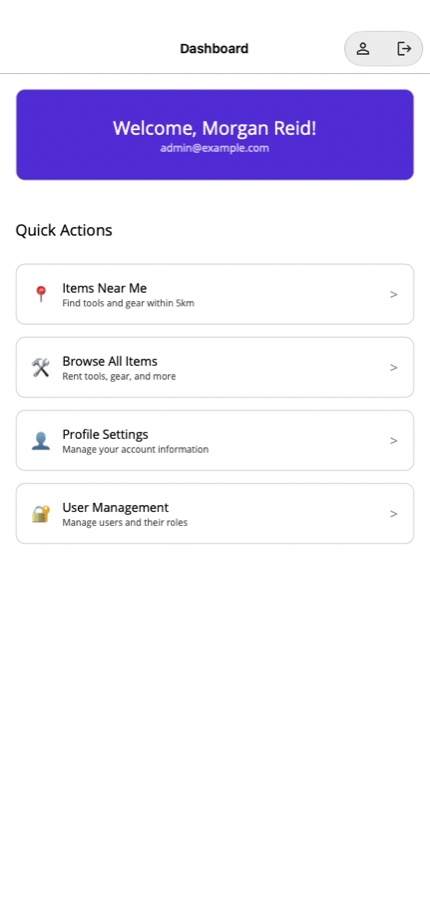
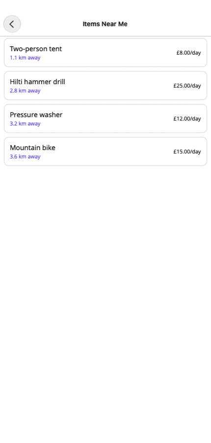
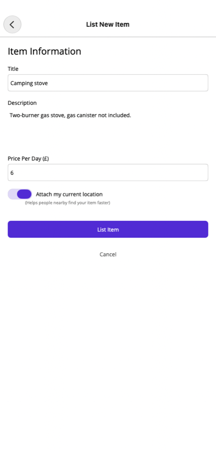
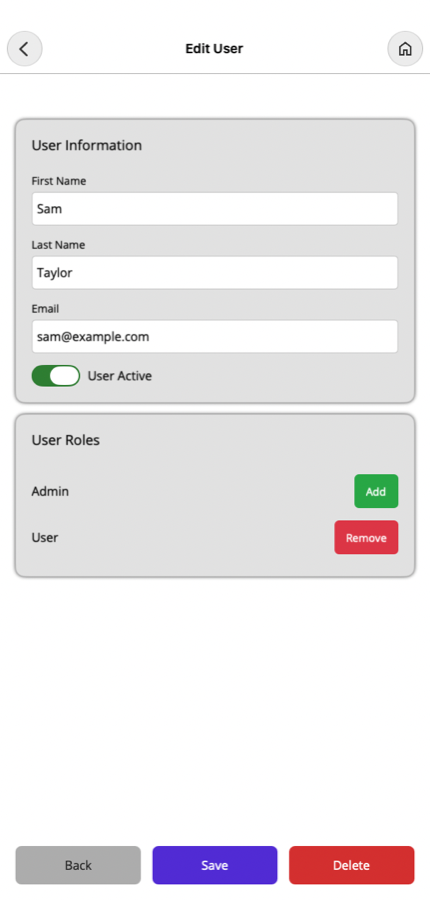
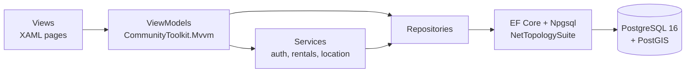

# RentalApp

[](https://github.com/OlehDzhumyk/RentalApp/actions/workflows/build.yml)
[](https://codecov.io/github/OlehDzhumyk/RentalApp)

A "library of things" app built with .NET MAUI: people list tools and gear they're happy to lend out, and
neighbours find them by distance. Location search runs in PostgreSQL with PostGIS, so "items within 5 km"
is a database query rather than a loop over every item.

<table>
  <tr>
    <td></td>
    <td></td>
    <td></td>
    <td></td>
  </tr>
  <tr>
    <td align="center">Dashboard</td>
    <td align="center">Items near me</td>
    <td align="center">Listing an item</td>
    <td align="center">Admin: user roles</td>
  </tr>
</table>

<sub>Screenshots from the Mac Catalyst build with the demo data, searching from Edinburgh Napier's Merchiston campus.</sub>

## Features

- **Accounts:** register and log in. Passwords are hashed with BCrypt, emails are case-insensitive, and every
  new account gets the default `User` role.
- **Listing items:** title, description and daily price. The device's current location can be attached to the item.
- **Items near me:** available items within a radius of the device, nearest first, with the distance calculated by PostGIS.
- **Browse:** every available item, with pull-to-refresh.
- **Profile:** see your details and roles, and change your password.
- **Admin:** search and filter users, edit their details, deactivate them, and add or remove roles.
- **Rental lifecycle (service layer only):** a borrower requests dates, and the service checks them against
  existing bookings and works out the price. The request can then be approved or rejected, and the item
  goes out, comes back and the rental is completed. Each status is a class
  ([State pattern](RentalApp.Database/States/)), so an invalid step such as returning an item that was never
  collected is refused. This part is covered by unit tests but doesn't have screens yet.

## How it works



- **MVVM.** Pages only bind to view models, and view models get everything through constructor injection
  (`MauiProgram.cs`). This is what makes them unit-testable: the tests swap navigation, location and
  data access for Moq fakes.
- **Repositories** (`RentalApp.Database/Repositories`) hide EF Core from the app. Each view model gets its
  own short-lived `DbContext`, because MAUI never creates DI scopes and a "scoped" context would end up
  shared across the whole app.
- **Spatial search.** `Item.Location` is a `geography(Point, 4326)` column with a GIST index. Because it is
  `geography` rather than `geometry`, PostGIS measures in metres on the globe. The repository's
  `IsWithinDistance` and `Distance` calls become `ST_DWithin` and `ST_Distance`, so filtering, sorting and the
  "1.1 km away" label all come from one query.
- **Migrations** live in their own console project (`RentalApp.Migrations`), which applies them and can
  seed demo data. A unit test fails if the model changes without a new migration.

## Running it locally

You need the [.NET 10 SDK](https://dotnet.microsoft.com/download), the MAUI workload
(`dotnet workload install maui`) and Docker.

```bash
git clone https://github.com/OlehDzhumyk/RentalApp.git
cd RentalApp

docker compose up -d                                   # PostgreSQL 16 + PostGIS on localhost:5432
dotnet run --project RentalApp.Migrations -- --seed    # create the schema and add demo data
```

Then run the app on a platform your machine supports:

```bash
dotnet build RentalApp -t:Run -f net10.0-maccatalyst          # macOS
dotnet build RentalApp -t:Run -f net10.0-windows10.0.19041.0  # Windows
dotnet build RentalApp -t:Run -f net10.0-android              # Android emulator (see below)
```

Log in as `admin@example.com` (admin) or `sam@example.com` (ordinary user). The password for both is `Password123`.

The connection string is in [`RentalApp.Database/appsettings.json`](RentalApp.Database/appsettings.json) and
points at the local Docker database. You can override it with the `RENTALAPP_CONNECTION` environment
variable. To an Android emulator, `localhost` means the emulator itself, so forward the port first with
`adb reverse tcp:5432 tcp:5432`.

## Tests

The xUnit suite has 60 tests:

- **Unit tests** cover view models, services and rental states, with Moq standing in for the repositories,
  navigation and GPS.
- **Integration tests** run the repositories against a real PostGIS database. That includes checking that a
  search from Napier's Merchiston campus finds Edinburgh Castle about 1.9 km away and ignores an item in Glasgow.

```bash
docker compose up -d
dotnet test RentalApp.Test
```

GitHub Actions does more than run the tests. On every push it builds the solution, including the Android
target, applies the migrations to a PostGIS service container, runs the tests and uploads coverage to Codecov.

## Project structure

```
RentalApp/              MAUI app: Views (XAML), ViewModels, Services, platform code
RentalApp.Database/     EF Core context, models, repositories, rental states, demo data seeder
RentalApp.Migrations/   EF Core migrations + console app that applies them
RentalApp.Test/         xUnit unit and integration tests
```

## Limitations and next steps

- The app connects straight to PostgreSQL, which keeps a coursework project simple but means database
  credentials ship with the app. A real deployment would put an ASP.NET Core API in between and keep the
  database private.
- Rentals need screens: an item details page with "request these dates", and a list of incoming requests
  for owners to approve.
- The search radius is fixed at 5 km in the UI, although the view model already supports changing it.
